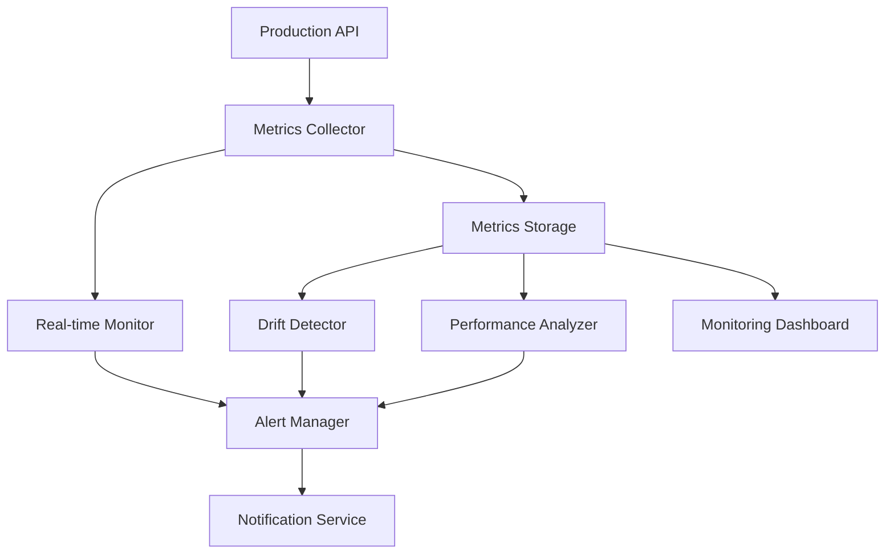

# Model Performance Monitoring

## Overview

This document describes the comprehensive performance monitoring system for XGBoost models in production, including metrics collection, drift detection, alerting, and dashboard visualization.

## Monitoring Architecture

### Components Overview



### Key Monitoring Components

1. **Metrics Collector**: Captures prediction metrics in real-time
2. **Drift Detector**: Analyzes feature and prediction distribution changes
3. **Performance Analyzer**: Tracks accuracy, latency, and throughput
4. **Alert Manager**: Triggers alerts based on thresholds
5. **Dashboard**: Visualizes metrics and trends

## Metrics Collection

### Core Metrics

#### 1. Prediction Metrics

```python
class PredictionMetrics(BaseModel):
    """Metrics collected for each prediction."""
    
    # Request metadata
    timestamp: datetime
    request_id: str
    user_id: Optional[str] = None
    session_id: str
    
    # Input features
    features: List[float]  # 19 features
    feature_hash: str      # Hash for deduplication
    
    # Model predictions
    predicted_css_classes: List[str]
    predicted_css_variables: Dict[str, float]
    prediction_confidence: Dict[str, float]
    
    # Performance metrics
    prediction_latency_ms: float
    feature_extraction_time_ms: float
    model_inference_time_ms: float
    
    # Model metadata
    model_version: str
    classifier_version: str
    regressor_version: str
    
    # Quality indicators
    input_validation_passed: bool
    prediction_quality_score: Optional[float] = None
```

#### 2. User Feedback Metrics

```python
class UserFeedbackMetrics(BaseModel):
    """User feedback and behavior metrics."""
    
    # Reference to original prediction
    prediction_request_id: str
    timestamp: datetime
    
    # User behavior indicators
    session_duration: int  # milliseconds
    interactions_count: int
    scroll_depth: float
    bounce_rate: float
    page_views: int
    
    # Explicit feedback (if available)
    user_satisfaction_rating: Optional[int] = None  # 1-5
    ui_preference_feedback: Optional[str] = None
    
    # Inferred feedback
    engagement_score: float  # 0-1 calculated from behavior
    design_effectiveness: float  # 0-1 inferred quality
    
    # A/B testing context
    experiment_id: Optional[str] = None
    variant: Optional[str] = None
```

### Metrics Collection Implementation

```python
class MetricsCollector:
    """Collects and stores model performance metrics."""
    
    def __init__(self, storage_backend: str = "firebase"):
        self.storage = self._initialize_storage(storage_backend)
        self.batch_size = 100
        self.flush_interval_seconds = 30
        self.metrics_buffer = []
        
    async def collect_prediction_metrics(
        self, 
        request_data: Dict[str, Any],
        prediction_data: Dict[str, Any],
        timing_data: Dict[str, float]
    ) -> None:
        """Collect metrics for a single prediction."""
        
        metrics = PredictionMetrics(
            timestamp=datetime.now(),
            request_id=request_data['request_id'],
            session_id=request_data['session_id'],
            features=request_data['features'],
            feature_hash=self._hash_features(request_data['features']),
            predicted_css_classes=prediction_data['css_classes'],
            predicted_css_variables=prediction_data['css_variables'],
            prediction_confidence=prediction_data['confidence'],
            prediction_latency_ms=timing_data['total_time'],
            feature_extraction_time_ms=timing_data['feature_time'],
            model_inference_time_ms=timing_data['inference_time'],
            model_version=prediction_data['model_version'],
            input_validation_passed=request_data['validation_passed']
        )
        
        # Add to buffer for batch processing
        self.metrics_buffer.append(metrics)
        
        # Flush if buffer is full
        if len(self.metrics_buffer) >= self.batch_size:
            await self._flush_metrics()
    
    async def collect_feedback_metrics(
        self, 
        feedback_data: Dict[str, Any]
    ) -> None:
        """Collect user feedback metrics."""
        
        metrics = UserFeedbackMetrics(**feedback_data)
        
        # Store feedback metrics
        await self.storage.store_feedback_metrics(metrics)
        
        # Trigger immediate analysis for feedback
        await self._analyze_feedback_impact(metrics)
```

## Performance Monitoring

### Real-time Performance Tracking

```python
class PerformanceMonitor:
    """Monitor model performance in real-time."""
    
    def __init__(self):
        self.monitoring_window_minutes = 5
        self.baseline_metrics = self._load_baseline_metrics()
        self.alert_thresholds = {
            'accuracy_drop': 0.05,        # 5% accuracy drop
            'latency_increase': 50,        # 50ms latency increase
            'error_rate_increase': 0.02,   # 2% error rate increase
            'throughput_drop': 0.20,       # 20% throughput drop
            'confidence_drop': 0.10        # 10% confidence drop
        }
        
    async def monitor_performance(self) -> Dict[str, Any]:
        """Monitor current performance against baselines."""
        
        # Get recent metrics
        end_time = datetime.now()
        start_time = end_time - timedelta(minutes=self.monitoring_window_minutes)
        
        recent_metrics = await self._get_metrics_in_window(start_time, end_time)
        
        if not recent_metrics:
            return {'status': 'no_data', 'metrics_count': 0}
        
        # Calculate current performance
        current_performance = self._calculate_performance_metrics(recent_metrics)
        
        # Compare with baseline
        performance_comparison = self._compare_with_baseline(
            current_performance, self.baseline_metrics
        )
        
        # Detect anomalies
        anomalies = self._detect_performance_anomalies(performance_comparison)
        
        return {
            'status': 'healthy' if not anomalies else 'anomalies_detected',
            'monitoring_window': {
                'start': start_time.isoformat(),
                'end': end_time.isoformat(),
                'duration_minutes': self.monitoring_window_minutes
            },
            'metrics_count': len(recent_metrics),
            'current_performance': current_performance,
            'baseline_performance': self.baseline_metrics,
            'performance_comparison': performance_comparison,
            'anomalies': anomalies,
            'timestamp': datetime.now().isoformat()
        }
    
    def _calculate_performance_metrics(
        self, 
        metrics: List[PredictionMetrics]
    ) -> Dict[str, float]:
        """Calculate aggregated performance metrics."""
        
        if not metrics:
            return {}
        
        # Latency metrics
        latencies = [m.prediction_latency_ms for m in metrics]
        
        # Confidence metrics
        confidences = []
        for m in metrics:
            if m.prediction_confidence:
                avg_confidence = np.mean(list(m.prediction_confidence.values()))
                confidences.append(avg_confidence)
        
        # Error rate (validation failures)
        validation_failures = sum(1 for m in metrics if not m.input_validation_passed)
        error_rate = validation_failures / len(metrics)
        
        return {
            'avg_latency_ms': np.mean(latencies),
            'p95_latency_ms': np.percentile(latencies, 95),
            'p99_latency_ms': np.percentile(latencies, 99),
            'throughput_per_minute': len(metrics) / self.monitoring_window_minutes,
            'avg_confidence': np.mean(confidences) if confidences else 0.0,
            'error_rate': error_rate,
            'total_predictions': len(metrics)
        }
    
    def _detect_performance_anomalies(
        self, 
        comparison: Dict[str, Dict[str, float]]
    ) -> List[Dict[str, Any]]:
        """Detect performance anomalies based on thresholds."""
        
        anomalies = []
        
        for metric_name, metric_data in comparison.items():
            current_value = metric_data['current']
            baseline_value = metric_data['baseline']
            change = metric_data['change']
            change_percent = metric_data['change_percent']
            
            # Check specific thresholds
            if metric_name == 'avg_latency_ms':
                if change > self.alert_thresholds['latency_increase']:
                    anomalies.append({
                        'type': 'latency_increase',
                        'severity': 'high' if change > 100 else 'medium',
                        'metric': metric_name,
                        'current_value': current_value,
                        'baseline_value': baseline_value,
                        'change': change,
                        'threshold': self.alert_thresholds['latency_increase']
                    })
            
            elif metric_name == 'error_rate':
                if change > self.alert_thresholds['error_rate_increase']:
                    anomalies.append({
                        'type': 'error_rate_increase',
                        'severity': 'high',
                        'metric': metric_name,
                        'current_value': current_value,
                        'baseline_value': baseline_value,
                        'change': change,
                        'threshold': self.alert_thresholds['error_rate_increase']
                    })
            
            elif metric_name == 'avg_confidence':
                if abs(change) > self.alert_thresholds['confidence_drop']:
                    anomalies.append({
                        'type': 'confidence_drop',
                        'severity': 'medium',
                        'metric': metric_name,
                        'current_value': current_value,
                        'baseline_value': baseline_value,
                        'change': change,
                        'threshold': self.alert_thresholds['confidence_drop']
                    })
        
        return anomalies
```

## Data Drift Detection

### Feature Drift Monitoring

```python
class DriftDetector:
    """Detect feature and prediction drift in production data."""
    
    def __init__(self):
        self.drift_detection_window_hours = 24
        self.baseline_distribution_days = 30
        self.drift_threshold = 0.15  # 15% distribution change threshold
        
    async def detect_feature_drift(self) -> Dict[str, Any]:
        """Detect drift in input feature distributions."""
        
        # Get baseline feature distribution
        baseline_features = await self._get_baseline_features()
        
        # Get recent feature distribution
        recent_features = await self._get_recent_features()
        
        if not baseline_features or not recent_features:
            return {'status': 'insufficient_data'}
        
        # Calculate drift for each feature
        feature_drifts = {}
        
        for i in range(19):  # 19 features
            baseline_dist = [f[i] for f in baseline_features]
            recent_dist = [f[i] for f in recent_features]
            
            # Calculate KL divergence or other drift metrics
            drift_score = self._calculate_drift_score(baseline_dist, recent_dist)
            feature_drifts[f'feature_{i}'] = drift_score
        
        # Identify significant drifts
        significant_drifts = {
            feature: score for feature, score in feature_drifts.items()
            if score > self.drift_threshold
        }
        
        # Overall drift assessment
        max_drift = max(feature_drifts.values()) if feature_drifts else 0
        avg_drift = np.mean(list(feature_drifts.values())) if feature_drifts else 0
        
        return {
            'status': 'drift_detected' if significant_drifts else 'no_drift',
            'max_drift_score': max_drift,
            'avg_drift_score': avg_drift,
            'drift_threshold': self.drift_threshold,
            'feature_drifts': feature_drifts,
            'significant_drifts': significant_drifts,
            'baseline_period_days': self.baseline_distribution_days,
            'detection_window_hours': self.drift_detection_window_hours,
            'baseline_samples': len(baseline_features),
            'recent_samples': len(recent_features),
            'timestamp': datetime.now().isoformat()
        }
    
    def _calculate_drift_score(
        self, 
        baseline_dist: List[float], 
        recent_dist: List[float]
    ) -> float:
        """Calculate drift score between two distributions."""
        
        from scipy import stats
        
        try:
            # Use Kolmogorov-Smirnov test for continuous features
            ks_statistic, p_value = stats.ks_2samp(baseline_dist, recent_dist)
            
            # Convert to drift score (0-1 scale)
            drift_score = ks_statistic
            
            return drift_score
            
        except Exception as e:
            logger.error(f"Error calculating drift score: {e}")
            return 0.0
    
    async def detect_prediction_drift(self) -> Dict[str, Any]:
        """Detect drift in model predictions."""
        
        # Get baseline predictions
        baseline_predictions = await self._get_baseline_predictions()
        
        # Get recent predictions
        recent_predictions = await self._get_recent_predictions()
        
        if not baseline_predictions or not recent_predictions:
            return {'status': 'insufficient_data'}
        
        # Analyze CSS class prediction drift
        class_drift = self._analyze_categorical_drift(
            [p['css_classes'] for p in baseline_predictions],
            [p['css_classes'] for p in recent_predictions]
        )
        
        # Analyze CSS variable prediction drift
        variable_drift = self._analyze_numerical_drift(
            [p['css_variables'] for p in baseline_predictions],
            [p['css_variables'] for p in recent_predictions]
        )
        
        # Combined drift assessment
        overall_drift = max(class_drift['max_drift'], variable_drift['max_drift'])
        
        return {
            'status': 'drift_detected' if overall_drift > self.drift_threshold else 'no_drift',
            'overall_drift_score': overall_drift,
            'class_prediction_drift': class_drift,
            'variable_prediction_drift': variable_drift,
            'drift_threshold': self.drift_threshold,
            'baseline_samples': len(baseline_predictions),
            'recent_samples': len(recent_predictions),
            'timestamp': datetime.now().isoformat()
        }
```

## Alerting System

### Alert Manager

```python
class AlertManager:
    """Manage alerts for model performance issues."""
    
    def __init__(self):
        self.alert_config = self._load_alert_config()
        self.notification_service = NotificationService()
        self.alert_cooldown_minutes = 30  # Prevent spam
        self.recent_alerts = {}  # Track recent alerts
        
    async def process_monitoring_results(
        self, 
        performance_results: Dict[str, Any],
        drift_results: Dict[str, Any]
    ) -> List[Dict[str, Any]]:
        """Process monitoring results and trigger alerts."""
        
        alerts_triggered = []
        
        # Process performance anomalies
        if performance_results.get('anomalies'):
            for anomaly in performance_results['anomalies']:
                alert = await self._create_performance_alert(anomaly)
                if await self._should_send_alert(alert):
                    await self._send_alert(alert)
                    alerts_triggered.append(alert)
        
        # Process drift alerts
        if drift_results.get('status') == 'drift_detected':
            drift_alert = await self._create_drift_alert(drift_results)
            if await self._should_send_alert(drift_alert):
                await self._send_alert(drift_alert)
                alerts_triggered.append(drift_alert)
        
        return alerts_triggered
    
    async def _create_performance_alert(self, anomaly: Dict[str, Any]) -> Dict[str, Any]:
        """Create performance alert from anomaly."""
        
        alert_id = f"perf_{anomaly['type']}_{datetime.now().strftime('%Y%m%d_%H%M%S')}"
        
        return {
            'alert_id': alert_id,
            'type': 'performance',
            'subtype': anomaly['type'],
            'severity': anomaly['severity'],
            'timestamp': datetime.now().isoformat(),
            'title': f"Model Performance Alert: {anomaly['type'].replace('_', ' ').title()}",
            'description': f"Detected {anomaly['type']} in model performance",
            'metrics': {
                'current_value': anomaly['current_value'],
                'baseline_value': anomaly['baseline_value'],
                'change': anomaly['change'],
                'threshold': anomaly['threshold']
            },
            'recommended_actions': self._get_recommended_actions(anomaly['type']),
            'dashboards': [
                'https://monitoring.company.com/models/performance',
                'https://monitoring.company.com/models/latency'
            ]
        }
    
    async def _create_drift_alert(self, drift_results: Dict[str, Any]) -> Dict[str, Any]:
        """Create drift alert from drift detection results."""
        
        alert_id = f"drift_{datetime.now().strftime('%Y%m%d_%H%M%S')}"
        
        significant_drifts = drift_results.get('significant_drifts', {})
        max_drift = drift_results.get('max_drift_score', 0)
        
        return {
            'alert_id': alert_id,
            'type': 'drift',
            'subtype': 'data_drift',
            'severity': 'high' if max_drift > 0.3 else 'medium',
            'timestamp': datetime.now().isoformat(),
            'title': f"Data Drift Alert: {len(significant_drifts)} features affected",
            'description': f"Significant data drift detected in {len(significant_drifts)} features",
            'metrics': {
                'max_drift_score': max_drift,
                'avg_drift_score': drift_results.get('avg_drift_score', 0),
                'affected_features': list(significant_drifts.keys()),
                'drift_threshold': drift_results.get('drift_threshold', 0.15)
            },
            'recommended_actions': [
                'Review recent data quality',
                'Consider model retraining',
                'Analyze feature importance changes',
                'Check data pipeline for issues'
            ],
            'dashboards': [
                'https://monitoring.company.com/models/drift',
                'https://monitoring.company.com/data/quality'
            ]
        }
    
    def _get_recommended_actions(self, anomaly_type: str) -> List[str]:
        """Get recommended actions for different anomaly types."""
        
        actions_map = {
            'latency_increase': [
                'Check system resource usage',
                'Review recent model changes',
                'Consider model optimization',
                'Scale infrastructure if needed'
            ],
            'accuracy_drop': [
                'Analyze recent predictions',
                'Check data quality',
                'Consider immediate retraining',
                'Review feature engineering'
            ],
            'error_rate_increase': [
                'Check input validation logic',
                'Review API error logs',
                'Validate data sources',
                'Check model loading status'
            ],
            'confidence_drop': [
                'Analyze prediction confidence trends',
                'Check for data distribution changes',
                'Review model uncertainty',
                'Consider ensemble methods'
            ]
        }
        
        return actions_map.get(anomaly_type, ['Contact ML team for investigation'])
```

## Notification Service

### Multi-Channel Notifications

```python
class NotificationService:
    """Send notifications through multiple channels."""
    
    def __init__(self):
        self.config = self._load_notification_config()
        
    async def send_alert(self, alert: Dict[str, Any]) -> Dict[str, Any]:
        """Send alert through configured channels."""
        
        results = {
            'alert_id': alert['alert_id'],
            'channels_attempted': [],
            'channels_successful': [],
            'channels_failed': []
        }
        
        # Email notifications
        if self.config.get('email', {}).get('enabled', False):
            results['channels_attempted'].append('email')
            try:
                await self._send_email_alert(alert)
                results['channels_successful'].append('email')
            except Exception as e:
                results['channels_failed'].append({'channel': 'email', 'error': str(e)})
        
        # Slack notifications
        if self.config.get('slack', {}).get('enabled', False):
            results['channels_attempted'].append('slack')
            try:
                await self._send_slack_alert(alert)
                results['channels_successful'].append('slack')
            except Exception as e:
                results['channels_failed'].append({'channel': 'slack', 'error': str(e)})
        
        # PagerDuty for high severity
        if alert['severity'] == 'high' and self.config.get('pagerduty', {}).get('enabled', False):
            results['channels_attempted'].append('pagerduty')
            try:
                await self._send_pagerduty_alert(alert)
                results['channels_successful'].append('pagerduty')
            except Exception as e:
                results['channels_failed'].append({'channel': 'pagerduty', 'error': str(e)})
        
        return results
    
    async def _send_email_alert(self, alert: Dict[str, Any]) -> None:
        """Send email alert."""
        
        email_config = self.config['email']
        
        subject = f"[{alert['severity'].upper()}] {alert['title']}"
        
        body = f"""
Model Performance Alert

Alert ID: {alert['alert_id']}
Type: {alert['type']} - {alert['subtype']}
Severity: {alert['severity']}
Time: {alert['timestamp']}

Description:
{alert['description']}

Metrics:
{json.dumps(alert['metrics'], indent=2)}

Recommended Actions:
{chr(10).join('- ' + action for action in alert['recommended_actions'])}

Dashboards:
{chr(10).join('- ' + url for url in alert.get('dashboards', []))}

This is an automated alert from the Frontend Efímero ML monitoring system.
        """
        
        # Implementation would use SMTP or email service
        logger.info(f"Sending email alert: {subject}")
    
    async def _send_slack_alert(self, alert: Dict[str, Any]) -> None:
        """Send Slack alert."""
        
        slack_config = self.config['slack']
        
        # Format Slack message
        color = {
            'high': '#ff0000',      # Red
            'medium': '#ff8c00',    # Orange
            'low': '#ffff00'        # Yellow
        }.get(alert['severity'], '#808080')
        
        slack_message = {
            "text": f"Model Performance Alert: {alert['title']}",
            "attachments": [
                {
                    "color": color,
                    "fields": [
                        {
                            "title": "Alert Type",
                            "value": f"{alert['type']} - {alert['subtype']}",
                            "short": True
                        },
                        {
                            "title": "Severity",
                            "value": alert['severity'].upper(),
                            "short": True
                        },
                        {
                            "title": "Description",
                            "value": alert['description'],
                            "short": False
                        }
                    ],
                    "timestamp": int(datetime.fromisoformat(alert['timestamp']).timestamp())
                }
            ]
        }
        
        # Implementation would use Slack webhook
        logger.info(f"Sending Slack alert: {alert['title']}")
```

## Monitoring Dashboard

### Performance Dashboard Implementation

```python
class MonitoringDashboard:
    """Real-time monitoring dashboard for model performance."""
    
    def __init__(self):
        self.metrics_storage = MetricsStorage()
        self.performance_monitor = PerformanceMonitor()
        self.drift_detector = DriftDetector()
        
    async def get_dashboard_data(self) -> Dict[str, Any]:
        """Get comprehensive dashboard data."""
        
        # Current performance status
        current_performance = await self.performance_monitor.monitor_performance()
        
        # Drift analysis
        feature_drift = await self.drift_detector.detect_feature_drift()
        prediction_drift = await self.drift_detector.detect_prediction_drift()
        
        # Historical trends
        performance_trends = await self._get_performance_trends()
        
        # Model metadata
        model_info = await self._get_current_model_info()
        
        # Recent alerts
        recent_alerts = await self._get_recent_alerts()
        
        return {
            'timestamp': datetime.now().isoformat(),
            'overall_status': self._determine_overall_status(
                current_performance, feature_drift, prediction_drift
            ),
            'current_performance': current_performance,
            'drift_analysis': {
                'feature_drift': feature_drift,
                'prediction_drift': prediction_drift
            },
            'performance_trends': performance_trends,
            'model_info': model_info,
            'recent_alerts': recent_alerts,
            'system_health': await self._get_system_health()
        }
    
    async def _get_performance_trends(self, days: int = 7) -> Dict[str, Any]:
        """Get performance trends over time."""
        
        end_time = datetime.now()
        start_time = end_time - timedelta(days=days)
        
        # Get hourly performance data
        hourly_data = await self.metrics_storage.get_hourly_performance(
            start_time, end_time
        )
        
        return {
            'period_days': days,
            'data_points': len(hourly_data),
            'metrics': {
                'latency_trend': [point['avg_latency_ms'] for point in hourly_data],
                'throughput_trend': [point['throughput'] for point in hourly_data],
                'error_rate_trend': [point['error_rate'] for point in hourly_data],
                'confidence_trend': [point['avg_confidence'] for point in hourly_data]
            },
            'timestamps': [point['timestamp'] for point in hourly_data]
        }
    
    def _determine_overall_status(
        self, 
        performance: Dict[str, Any],
        feature_drift: Dict[str, Any],
        prediction_drift: Dict[str, Any]
    ) -> str:
        """Determine overall system status."""
        
        # Check for critical issues
        if performance.get('status') == 'anomalies_detected':
            high_severity_anomalies = [
                a for a in performance.get('anomalies', [])
                if a.get('severity') == 'high'
            ]
            if high_severity_anomalies:
                return 'critical'
        
        # Check for significant drift
        if (feature_drift.get('status') == 'drift_detected' or 
            prediction_drift.get('status') == 'drift_detected'):
            max_drift = max(
                feature_drift.get('max_drift_score', 0),
                prediction_drift.get('overall_drift_score', 0)
            )
            if max_drift > 0.3:
                return 'warning'
        
        # Check for medium severity issues
        if performance.get('status') == 'anomalies_detected':
            return 'warning'
        
        return 'healthy'
```

## Deployment and Configuration

### Monitoring Service Deployment

```python
# monitoring/monitoring_service.py
class MonitoringService:
    """Main monitoring service orchestrator."""
    
    def __init__(self):
        self.metrics_collector = MetricsCollector()
        self.performance_monitor = PerformanceMonitor()
        self.drift_detector = DriftDetector()
        self.alert_manager = AlertManager()
        self.dashboard = MonitoringDashboard()
        
        self.monitoring_interval_minutes = 5
        self.drift_check_interval_hours = 1
        
    async def start_monitoring(self):
        """Start the monitoring service."""
        
        logger.info("Starting model performance monitoring service...")
        
        # Start monitoring tasks
        tasks = [
            self._performance_monitoring_loop(),
            self._drift_monitoring_loop(),
            self._metrics_flush_loop(),
            self._health_check_loop()
        ]
        
        await asyncio.gather(*tasks)
    
    async def _performance_monitoring_loop(self):
        """Main performance monitoring loop."""
        
        while True:
            try:
                # Monitor performance
                performance_results = await self.performance_monitor.monitor_performance()
                
                # Check for alerts
                alerts = await self.alert_manager.process_monitoring_results(
                    performance_results, {}
                )
                
                if alerts:
                    logger.info(f"Triggered {len(alerts)} performance alerts")
                
                # Wait for next cycle
                await asyncio.sleep(self.monitoring_interval_minutes * 60)
                
            except Exception as e:
                logger.error(f"Error in performance monitoring loop: {e}")
                await asyncio.sleep(60)  # Wait 1 minute before retry
    
    async def _drift_monitoring_loop(self):
        """Data drift monitoring loop."""
        
        while True:
            try:
                # Check feature drift
                feature_drift = await self.drift_detector.detect_feature_drift()
                
                # Check prediction drift
                prediction_drift = await self.drift_detector.detect_prediction_drift()
                
                # Process drift alerts
                drift_alerts = await self.alert_manager.process_monitoring_results(
                    {}, {'feature_drift': feature_drift, 'prediction_drift': prediction_drift}
                )
                
                if drift_alerts:
                    logger.info(f"Triggered {len(drift_alerts)} drift alerts")
                
                # Wait for next cycle
                await asyncio.sleep(self.drift_check_interval_hours * 3600)
                
            except Exception as e:
                logger.error(f"Error in drift monitoring loop: {e}")
                await asyncio.sleep(3600)  # Wait 1 hour before retry
```

Este sistema de monitoreo comprehensivo proporciona visibilidad completa del rendimiento de los modelos XGBoost en producción, con alertas automáticas y detección proactiva de problemas.