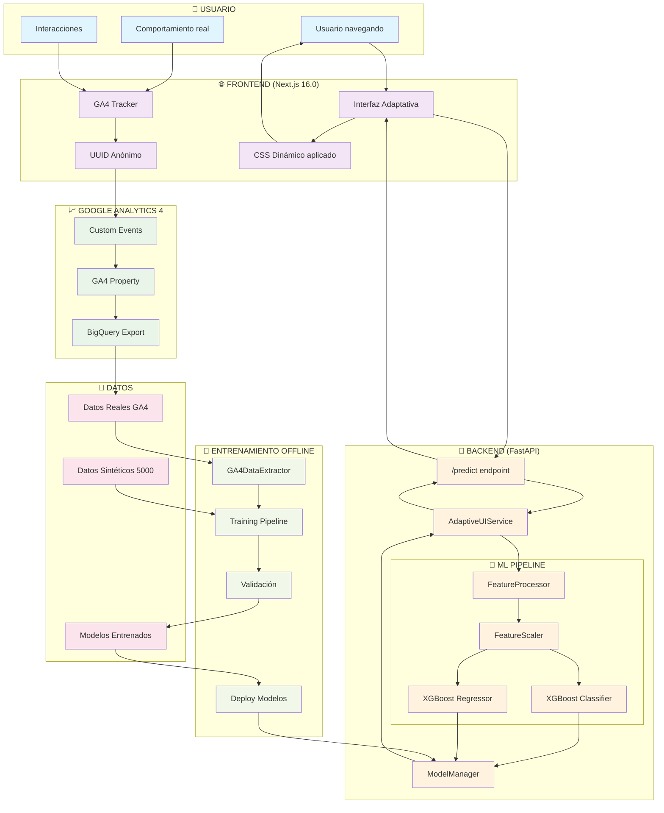
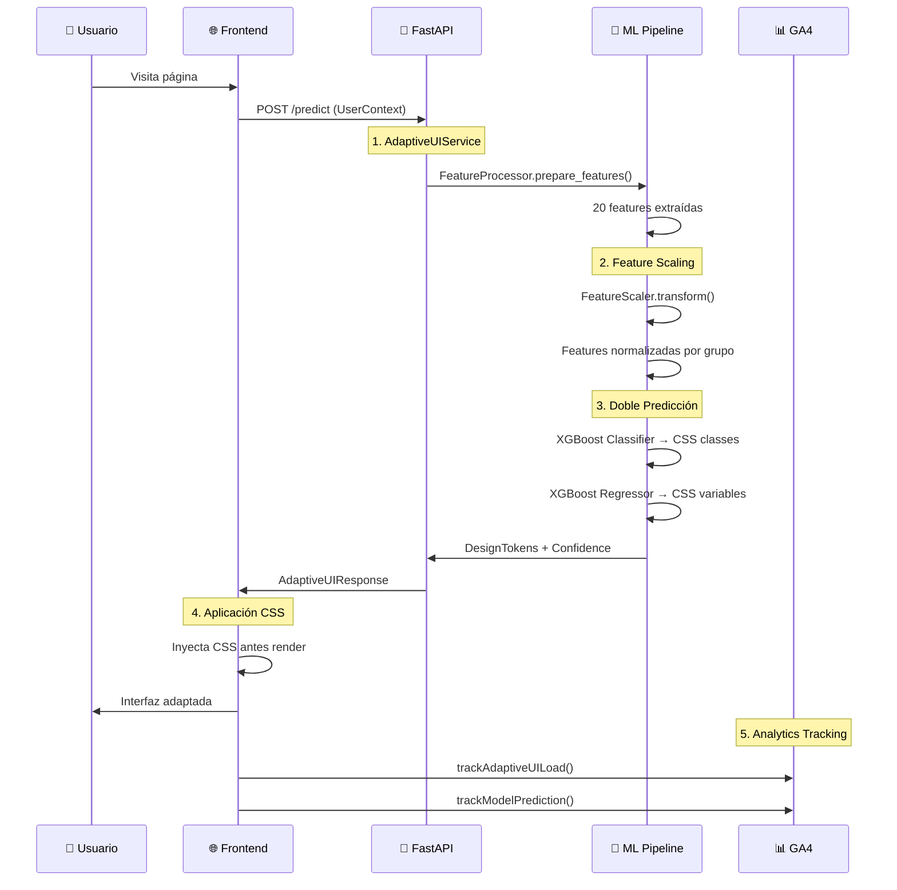
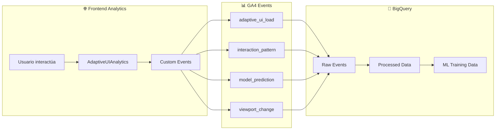
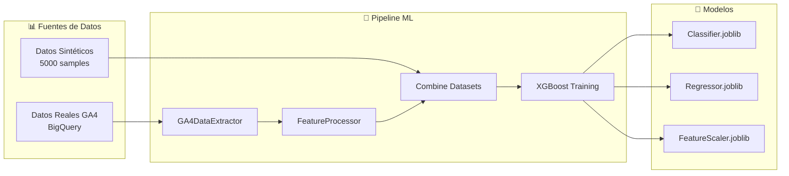

# 🏗️ Diagrama Arquitectura Completa - Frontend Efímero con GA4

## 📊 Flujo Completo del Sistema



## 🔄 Flujo Detallado por Fases

### **FASE 1: Predicción en Tiempo Real (< 100ms)**



### **FASE 2: Recolección de Datos Reales**



### **FASE 3: Entrenamiento Offline**



## 🧠 Arquitectura ML Detallada

### **Feature Engineering Pipeline**

```
📥 UserContext Input
├── 🕒 Temporal Features (4)
│   ├── hour_sin/cos → StandardScaler
│   └── day_sin/cos → StandardScaler
├── 📱 Device Features (5)
│   ├── touch_enabled → MinMaxScaler
│   ├── pixel_ratio → MinMaxScaler
│   ├── viewport_aspect → MinMaxScaler
│   ├── screen_area → MinMaxScaler
│   └── color_scheme → MinMaxScaler
├── 📊 Historical Features (5)
│   ├── session_count → RobustScaler
│   ├── avg_duration → RobustScaler
│   ├── interactions_count → RobustScaler
│   ├── page_diversity → RobustScaler
│   └── recent_activity → RobustScaler
├── 👥 Social Features (3)
│   ├── dark_mode_percentage → MinMaxScaler
│   ├── high_density_percentage → MinMaxScaler
│   └── serif_preference → MinMaxScaler
└── 🔗 Composite Features (3)
    ├── touch_vs_mouse_ratio → RobustScaler
    ├── auth_multiplier → RobustScaler
    └── mobile_correlation → RobustScaler

📤 Output: 20 features normalizadas
```

### **Dual XGBoost Architecture**

```
📊 Scaled Features (20)
├── 🎨 XGBoost Classifier
│   ├── Output: CSS Classes
│   │   ├── densidad-alta/media/baja
│   │   ├── fuente-serif/sans/mono
│   │   └── modo-nocturno/claro
│   └── Confidence: 0.0-1.0
└── 📏 XGBoost Regressor
    ├── Output: CSS Variables
    │   ├── --font-size-base: "1.067rem"
    │   ├── --spacing-unit: "0.82rem"
    │   └── --border-radius: "4px"
    └── Confidence: R² score
```

## 📊 GA4 Events Schema

### **adaptive_ui_load Event**
```json
{
  "event_name": "adaptive_ui_load",
  "user_temp_id": "uuid-anon-123",
  "css_classes_applied": ["densidad-alta", "fuente-serif"],
  "css_variables_applied": {
    "--font-size-base": "1.067rem",
    "--spacing-unit": "0.82rem"
  },
  "prediction_confidence": 0.89,
  "device_context": {
    "viewport_width": 1366,
    "viewport_height": 768,
    "pixel_ratio": 1.0,
    "touch_enabled": false
  },
  "processing_time_ms": 87
}
```

### **interaction_pattern Event**
```json
{
  "event_name": "interaction_pattern",
  "user_temp_id": "uuid-anon-123",
  "element_type": "button",
  "interaction_action": "click",
  "timing_ms": 1234,
  "success": true,
  "context_metadata": {
    "page_section": "hero",
    "adaptive_classes": ["densidad-alta"]
  }
}
```

## 🔄 Estados del Sistema

### **Estado Actual (Task 1.4 Completado)**
- ✅ Feature Engineering Pipeline completo
- ✅ GA4 Integration arquitectura implementada
- ✅ Frontend Next.js ejecutándose
- ✅ Datos sintéticos 5000 muestras validadas
- ⚠️ Modelos XGBoost usando mocks (Task 2.1-2.5 pendientes)

### **Próximos Pasos**
1. **Configurar GA4 Property real** → Obtener measurement_id
2. **Implementar modelos XGBoost reales** → Tasks 2.1-2.5  
3. **Setup entrenamiento offline** → Pipeline automático
4. **Validación end-to-end** → Testing completo

## 🎯 Métricas de Performance

- **Inferencia ML**: < 100ms (objetivo)
- **Feature Processing**: ~20ms actual
- **Predicción dual**: ~50ms estimado
- **CSS Injection**: < 10ms
- **Zero Flicker**: CSS antes de render
- **Privacy**: UUID anónimos, no PII

## 🔐 Privacidad y Seguridad

- **Anonimización**: UUID temporal, no tracking cross-site
- **GA4 Config**: IP anonymization, no Google Signals
- **Datos**: Solo comportamiento UI, no contenido personal
- **GDPR Compliance**: Datos agregados, opt-out disponible
